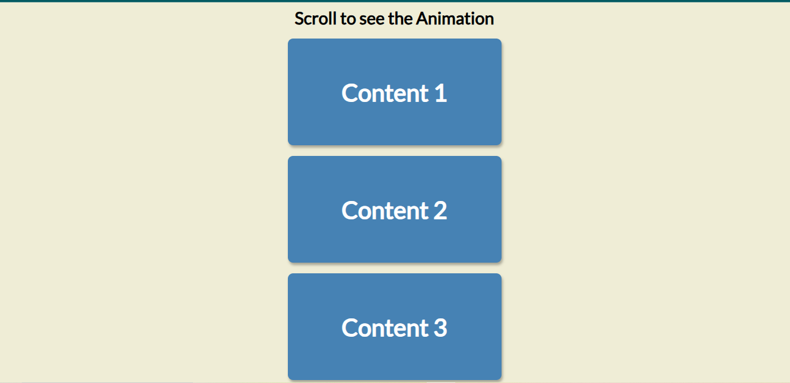

# 📜 Scroll Animation Effect

A smooth **scroll-triggered animation** built with HTML, CSS, and JavaScript.  
As the user scrolls, content boxes slide into view from alternating directions, creating a visually engaging effect.
---

## 📸 Preview


---

---

## 💡 Features
- Smooth sliding animation on scroll
- Alternating directions for visual variety
- Responsive design with centered layout
- Easy to customize with different content or animation styles

---

## 📜 How It Works
1. Each `.box` starts off-screen using `transform: translateX(±250%)`.
2. JavaScript listens for the `scroll` event.
3. When a `.box` enters the viewport (based on a trigger point), it gets the `.show` class.
4. `.show` resets the `transform` to `translateX(0)`, making the box slide into view.

---

## 🛠️ Technologies Used
- **HTML5** – Structure of the page
- **CSS3** – Styling, animations, and transitions
- **JavaScript (Vanilla)** – Detecting scroll position and triggering animations
- **Google Fonts** – Lato for typography

---

## 📂 Project Structure
 ```bash
📦 Scroll_Animation_Bar
┣ 📜 index.html # HTML structure with scrollable boxes
┣ 📜 style.css # Styling and animation effects
┣ 📜 script.js # Scroll detection and class toggling
┗ 📜 README.md
